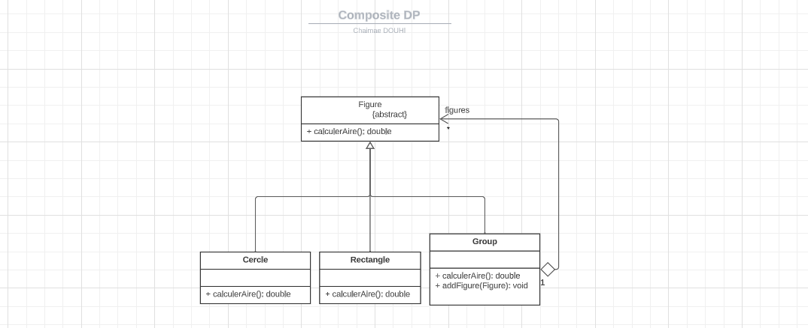
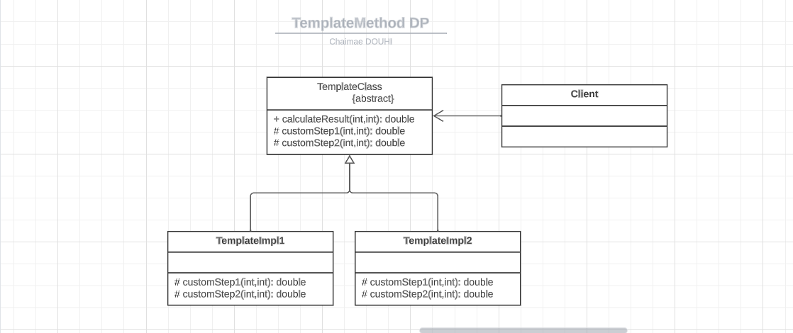
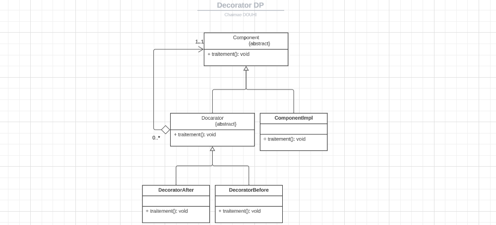
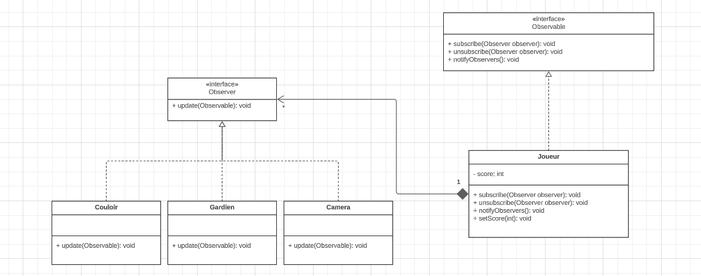
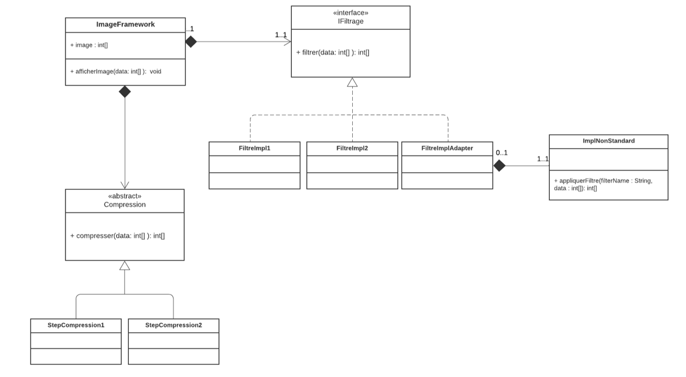

## <span style="color:violet;">TD1- Design Pattern📝</span>
### 🔶 Exercice 1
Créer les diagrammes de classes en mentionnant les designs patterns appropriés pour les situations
suivantes :

1 - Une figure peut être soit un cercle, un rectangle ou un groupe de figures.
### Class Diagram


### Implementation
#### Figure
```java
public abstract class Figure {
    public abstract double calculerAire();
}
```
#### Cercle
```java
public class Cercle extends Figure {
    private double rayon;

    public Cercle(double rayon) {
        this.rayon = rayon;
    }

    @Override
    public double calculerAire() {
        return Math.PI * Math.pow(rayon, 2);
    }
}
```
#### Rectangle
```java
public class Rectangle extends Figure {
    private double largeur;
    private double hauteur;

    public Rectangle(double largeur, double hauteur) {
        this.largeur = largeur;
        this.hauteur = hauteur;
    }

    @Override
    public double calculerAire() {
        return largeur * hauteur;
    }
}
``` 
#### Groupe
```java
public class Group extends Figure {
    public List<Figure> figures = new ArrayList<>();

    public void addFigure(Figure figure) {
        figures.add(figure);
    }


    @Override
    public double calculerAire() {
        double airTotale = 0;
        for (Figure figure : figures) {
            airTotale += figure.calculerAire();
        }
        return airTotale;
    }
}
```

2 - Un plugin contient une opération implémentant le squelette d’un algorithme dont deux parties
(partie1 et partie2) sont variables. On voudrait laisser le développeur la possibilité
d’implémenter les deux parties manquantes de cet algorithme et on voudrait aussi que
l’application cliente puisse instancier une implémentation concrète du plugin sans connaitre
sa classe d’implémentation.
### Class Diagram


### Implementation
#### TemplateClass
```java
public abstract class TemplateClass {
    public double calculateResult(int x, int y) {
        double comp = 0;
        double result1 = customStep1(x, y);
        double result2 = customStep2(x, y);
        comp++;
        return comp * (result1 + result2);
    }

    protected abstract double customStep1(int a, int b);

    protected abstract double customStep2(int a, int b);

}
```
#### TemplateClassImpl1
```java
public class TemplateImpl1 extends TemplateClass {
    @Override
    public double customStep1(int a, int b) {
        return a * b + Math.pow(a, b);
    }

    @Override
    public double customStep2(int a, int b) {
        return Math.max(a, b);
    }
}
```
#### TemplateClassImpl2
```java 
public class TemplateImpl2 extends TemplateClass {
    @Override
    public double customStep1(int a, int b) {
        return b + Math.pow(a, b);
    }

    @Override
    public double customStep2(int a, int b) {
        return Math.min(a, b);
    }
}
```

3 - On dispose d’un composant implémentant une interface qui définir une opération «
traitement() ». On voudrait rattacher à ce composant des responsabilités supplémentaires
sans modifier son code source. C'est-à-dire envelopper l’exécution de la méthode traitement
par d’autres traitements avant et après son exécution.
### Class Diagram


### Implementation
#### Component
```java
public abstract class Component {
    abstract void traitement();
}
```
#### Decorator
```java
public abstract class Decorator extends Component {
    protected Component component;

    public Decorator(Component component) {
        this.component = component;
    }
}
```
#### ComponentImpl
```java
public class ComponentImpl extends Component {
    @Override
    public void traitement() {
        System.out.println("=========== processing ... ============");
    }
}
```
#### DecoratorBefore
```java
public class DecoratorBefore extends Decorator {
    public DecoratorBefore(Component component) {
        super(component);
    }

    @Override
    public void traitement() {
        System.out.println("Additional behavior before the processing");
    }
}
```
#### DecoratorAfter
```java
public class DecoratorAfter extends Decorator {
    public DecoratorAfter(Component component) {
        super(component);
    }

    @Override
    public void traitement() {
        System.out.println("Additional behavior after the processing");
    }
}
```
4 - On désire créer une classe Joueur ayant un état représenté par une variable score de type int.
On voudrait que les objets de l’environnement du jeu (Couloir, Caméra et Gardien) soient
informés à chaque fois que le score du joueur change tout en gardant un couplage faible entre
la classe Joueur et les autres classes.
### Class Diagram


### Implementation
#### Observable
This interface represents the Observable in the Observer pattern. It defines the methods that are used to attach and detach observers to the Observable object. It also defines the method that is used to notify the observers when the state of the Observable object changes.
```java
public interface Observable {
    void subscribe(Observer observer);

    void unsubscribe(Observer observer);

    void notifyObservers();
}
```
#### Observer
This interface represents the Observer in the Observer pattern. It defines the method that is called by the Observable object when its state changes.
```java
public interface Observer {
    void update(Observable observable);
}
```
#### Joueur
```java
public class Joueur implements Observable {
    private int score;
    private List<Observer> observers;

    public Joueur() {
        score = 0;
        observers = new ArrayList<>();
    }

    public void subscribe(Observer observer) {
        observers.add(observer);
    }

    public void unsubscribe(Observer observer) {
        observers.remove(observer);
    }

    @Override
    public void notifyObservers() {
        for (Observer observer : observers) {
            observer.update(this);
        }
    }

    public int getScore() {
        return score;
    }

    public void setScore(int score) {
        this.score = score;
        this.notifyObservers();
    }

}
```
#### Couloir
```java
public class Couloir implements Observer {
    @Override
    public void update(Observable observable) {
        int score = ((Joueur) observable).getScore();
        displayUpdatedScore(score);
        handleScore(score);
    }

    private static void displayUpdatedScore(int score) {
        System.out.println("** Couloir **");
        System.out.println("Player's score has changed to: " + score);
    }

    private void handleScore(int score) {
        if (score > 75) {
            displayHighScoreMessage();
        } else {
            displayNormalScoreMessage();
        }
    }

    private void displayHighScoreMessage() {
        displayMessage("High score achieved! Lights are flashing.");
    }

    private void displayNormalScoreMessage() {
        displayMessage("Normal score. Lights remain steady.");
    }

    private void displayMessage(String message) {
        System.out.println(message);
    }
}
```
#### Camera
```java
public class Camera implements Observer {
    @Override
    public void update(Observable observable) {
        int score = ((Joueur) observable).getScore();
        displayUpdatedScore(score);
        double result = calculateResult(score);
        handleResult(result);
    }

    private static void displayUpdatedScore(int score) {
        System.out.println("** Camera **");
        System.out.println("Player's score has changed to: " + score);
    }

    private double calculateResult(int score) {
        return Math.pow(score, score) * 21;
    }

    private void handleResult(double result) {
        if (result > 100) {
            zoomInForCloseup();
        } else if (result > 50) {
            captureStandardShot();
        } else {
            noAdditionalActionRequired();
        }
    }

    private void zoomInForCloseup() {
        System.out.println("High score detected! Zooming in for a close-up shot.");
    }

    private void captureStandardShot() {
        System.out.println("Moderate score detected. Capturing a standard shot.");
    }

    private void noAdditionalActionRequired() {
        System.out.println("Low score. No additional action required in the camera.");
    }
}
```
#### Gardien
```java
public class Gardien implements Observer {
    @Override
    public void update(Observable observable) {
        int score = ((Joueur) observable).getScore();
        displayUpdatedScore(score);

        if (score >= 100) {
            triggerSecurityAlert("High score detected!");
        } else if (score < 0) {
            triggerSecurityAlert("Negative score detected!");
        } else {
            System.out.println("No action necessary for the current score.");
        }
    }

    private static void displayUpdatedScore(int score) {
        System.out.println("** Gradien **");
        System.out.println("Player's score has changed to: " + score);
    }

    private void triggerSecurityAlert(String message) {
        System.out.println("SECURITY ALERT: " + message);
    }
}

```

### 🔶 Exercice 2 ️
On souhaite concevoir et développer un Framework qui permet d’effectuer des traitements sur une
image. L’image étant représentée par un tableau d’entiers. Le Framework définit deux opérations
principales :

Une opération qui permet de filtrer l’image dont la signature est :
* public int[] filter (int [] data)
Une opération qui permet de compresser l’image dont la signature est :
* public int[] compresser (int [] data)
Le Framework doit respecter les critères suivants :

Il doit être fermé à la modification et ouvert à l’extension.

L’opération de filtrage à effectuer peut évoluer dans le temps. Cela signifie que l’utilisateur
de l’application peut, lui-même, définir de nouvelles implémentations de l’opération de
filtrage.

Au moment de l’exécution, on peut changer dynamiquement la version de
l’implémentation de filtrage à appliquer à l’image.
Permettre au Framework d’utiliser une ancienne implémentation (ImplNonStandard)
d’une opération de filtrage dont la signature est :
* public int[] appliquerFiltre(String filterName, int[] data)

Pour l’opération de compression, on souhaite définir le squelette de l’algorithme de
compression et déléguer les détails de cet algorithme aux sous classes.

### Class Diagram


Dans cette exercice j’ai utilisé dans ce cas 4 designs patterns : **Singleton**, **Strategy**, **Adapter**, **Template Method**.

* Strategy : pour avoir plusieurs implémentations de l’opération de filtrage.
* Adapter : pour adapter l’ancienne implémentation de l’opération de filtrage à l’interface de l’opération de filtrage.
* Template Method : pour définir le squelette de l’algorithme de compression et déléguer les détails de cet algorithme aux sous classes.

### Implementation
#### Adapter : 
* FiltrageAdapter
```java
public class FiltrageAdapter implements FilterStrategy {
    private ImplNonStandard implNonStandard;

    @Override
    public int[] filter(int[] data) {
        return implNonStandard.applyFilter("filterAdapter", data);
    }
}
```
* ImplNonStandard
```java
public class ImplNonStandard {
    public int[] applyFilter(String filterName, int[] data) {
        int[] filteredData = new int[data.length];
        if ("filterAdapter".equals(filterName)) {
            for (int i = 0; i < data.length; i++) {
                filteredData[i] = data[i] * 2;
            }
        } else {
            filteredData = data.clone();
        }

        return filteredData;
    }
}
```
#### Strategy :
* FilterStrategy
```java
public interface FilterStrategy {
    int[] filter(int[] data);
}
```
* FilterImpl1
```java
public class FiltrageImpl1 implements FilterStrategy {
    @Override
    public int[] filter(int[] data) {
        int[] filteredData = new int[data.length];
        for (int i = 0; i < data.length; i++) {
            filteredData[i] = data[i] * 2;
        }
        System.out.println("** FiltrageImpl1 **");
        return filteredData;
    }
}
```
* FilterImpl2
```java
public class FiltrageImpl2 implements FilterStrategy {
    @Override
    public int[] filter(int[] data) {
        int[] filteredData = new int[data.length];
        for (int i = 0; i < data.length; i++) {
            filteredData[i] = data[i] + 10;
        }
        System.out.println("** FiltrageImpl2 **");
        return filteredData;
    }
}
```
#### Template Method :
* ImageCompressionAlgorithm
```java
public abstract class ImageCompressionAlgorithm {
    public int[] compress(int[] data) {
        int[] preprocessedData = preprocess(data);

        int[] compressedData = performCompression(preprocessedData);

        int[] postprocessedData = postprocess(compressedData);

        return postprocessedData;
    }

    protected abstract int[] preprocess(int[] data);

    protected abstract int[] performCompression(int[] data);

    protected abstract int[] postprocess(int[] data);

}
```
* CustomImageCompressionAlgorithm1
```java
public class CustomImageCompressionAlgorithm1 extends ImageCompressionAlgorithm {
    @Override
    protected int[] preprocess(int[] data) {
        int[] preprocessedData = new int[data.length / 2];
        for (int i = 0; i < data.length; i += 2) {
            preprocessedData[i / 2] = data[i];
        }
        return preprocessedData;
    }

    @Override
    protected int[] performCompression(int[] data) {
        int[] compressedData = new int[data.length];
        for (int i = 0; i < data.length; i++) {
            compressedData[i] = data[i] / 2;
        }
        return compressedData;
    }

    @Override
    protected int[] postprocess(int[] data) {
        int[] postprocessedData = new int[data.length];
        for (int i = 0; i < data.length; i++) {
            postprocessedData[i] = data[i] + 20;
        }
        return postprocessedData;
    }
}
```
* CustomImageCompressionAlgorithm2
```java
public class CustomImageCompressionAlgorithm2 extends ImageCompressionAlgorithm {
    @Override
    protected int[] preprocess(int[] data) {
        int[] preprocessedData = new int[data.length];
        for (int i = 0; i < data.length; i++) {
            preprocessedData[i] = data[i] - 1;
        }
        return preprocessedData;
    }

    @Override
    protected int[] performCompression(int[] data) {
        int[] compressedData = new int[data.length];
        for (int i = 0; i < data.length; i++) {
            compressedData[i] = data[i] / 3;
        }
        return compressedData;
    }

    @Override
    protected int[] postprocess(int[] data) {
        int[] postprocessedData = new int[data.length];
        for (int i = 0; i < data.length; i++) {
            postprocessedData[i] = data[i] + 17;
        }
        return postprocessedData;
    }
}
```
#### ImageFramework
```java
public class ImageFramework {
    private int[] image;
    private FilterStrategy filterStrategy;
    private ImageCompressionAlgorithm imageCompressionAlgorithm;


    public ImageFramework(int[] image) {
        this.image = image;
    }

    public void displayImage(int[] image) {
        System.out.println("\t\tDisplaying image... ");
        for (int i = 0; i < image.length; i++) {
            System.out.print(image[i] + " ");
        }
        System.out.println("\n\n");
    }

    public void setFilterStrategy(FilterStrategy filterStrategy) {
        this.filterStrategy = filterStrategy;
    }

    public void setImageCompressionAlgorithm(ImageCompressionAlgorithm imageCompressionAlgorithm) {
        this.imageCompressionAlgorithm = imageCompressionAlgorithm;
    }

    public FilterStrategy getFilterStrategy() {
        return filterStrategy;
    }

    public ImageCompressionAlgorithm getImageCompressionAlgorithm() {
        return imageCompressionAlgorithm;
    }
}
```

### Conclusion
Dans ce TD j’ai appris comment utiliser les designs patterns dans la conception et le développement d’un Framework. J’ai utilisé dans ce cas 4 designs patterns : **Singleton**, **Strategy**, **Adapter**, **Template Method**, **Observer**, **Composite**, **Decorator**,etc.

